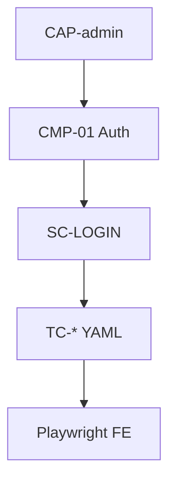

# CAP-admin — Admin capability

Capability mặc định của cụm base (dự án nhỏ = **một** CAP bắt buộc).

| | |
|--|--|
| **Id** | `CAP-admin` |
| **Mô tả** | Vận hành admin web: đăng nhập, quản trị trong phạm vi portal |
| **Features (CMP)** | [CMP-01 Auth](../scenarios/CMP-01-auth/SC-LOGIN.md) |
| **Target** | [CTR-admin-web](../targets/CTR-admin-web.md) |

Rule / acceptance SSOT: **base-docs** (cite `RUL-*` từ TC/SC, không copy nội dung vào hub).
