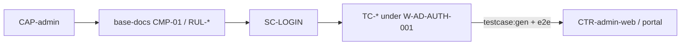

# LND-qa-map

Bản đồ QA — CAP ↔ CMP ↔ scenarios ↔ FE targets.

| Design / hub | Test |
|--------------|------|
| [CAP-admin](./CAP-admin.md) | Capability |
| CMP-01 Auth · rules trên base-docs | [SC-LOGIN](../scenarios/CMP-01-auth/SC-LOGIN.md) |
| W-AD-AUTH-001 | [cases/W-AD-AUTH-001/](../cases/W-AD-AUTH-001/) |
| CTR-admin-web | [CTR-admin-web](../targets/CTR-admin-web.md) |

Glossary: [catalog/GLOSSARY.md](../catalog/GLOSSARY.md) · Tracking: [NOTE-testing-architecture.md](./NOTE-testing-architecture.md)
