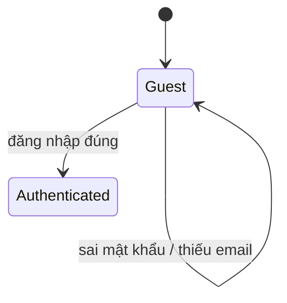

# SC-LOGIN — Đăng nhập admin

Scenario nghiệp vụ dưới **CMP-01 Auth** · capability **CAP-admin**.  
Rule chi tiết sống trên **base-docs** (chỉ cite id bên dưới).

| | |
|--|--|
| **Scenario** | `SC-LOGIN` |
| **Capability** | `CAP-admin` |
| **Component** | `CMP-01` |
| **Screen** | `W-AD-AUTH-001` |
| **Target** | `CTR-admin-web` |

## Vì sao quan trọng

Operator cần vào admin an toàn. Sai mật khẩu hoặc thiếu email thì không được vào — tránh lộ thông tin tài khoản.

## Hành vi (Given / When / Then)

**Given** đã có tài khoản operator còn hiệu lực  
**When** nhập email và mật khẩu rồi bấm Đăng nhập  
**Then** vào được khu vực admin đã xác thực (hoặc thấy lỗi rõ ràng nếu dữ liệu không hợp lệ)

## Ví dụ (Specification by Example)

| # | Email | Password | Kết quả mong đợi | Automation |
|---|-------|----------|------------------|------------|
| EX-LOGIN-01 | hợp lệ | đúng | Vào admin | `TC-LOGIN-VALID` |
| EX-LOGIN-02 | hợp lệ | sai | Báo lỗi, ở lại login | `TC-LOGIN-BAD-PASSWORD` |
| EX-LOGIN-03 | trống | bất kỳ | Lỗi email, không gọi login | `TC-LOGIN-EMPTY-EMAIL` |
| EX-LOGIN-04 | — (sau login) | — | Shell không lỗi WCAG A/AA nghiêm trọng | `TC-LOGIN-A11Y` |

## Bao phủ (risk)

| Facet | Có? | Ghi chú |
|-------|-----|---------|
| happy | EX-01 | smoke |
| validation | EX-03 | |
| exception | EX-02 | |
| accessibility | EX-04 | axe trên FE |
| authorization / state / … | chưa | backlog khi docs có rule |

## Cases

| ID | coverage | Folder |
|----|----------|--------|
| TC-LOGIN-VALID | happy | [cases/W-AD-AUTH-001](../../cases/W-AD-AUTH-001/) |
| TC-LOGIN-BAD-PASSWORD | exception | same |
| TC-LOGIN-EMPTY-EMAIL | validation | same |
| TC-LOGIN-A11Y | accessibility | same |
