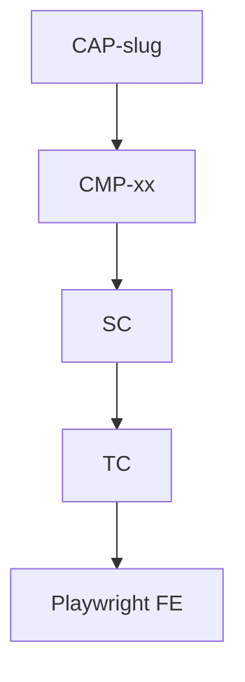

# CAP-_slug_ — _Tên capability ngắn_

Capability **bắt buộc** (dự án nhỏ cũng ≥1). Copy → `landscape/CAP-<slug>.md`.

| | |
|--|--|
| **Id** | `CAP-<slug>` |
| **Mô tả** | _1–2 câu: phạm vi nghiệp vụ_ |
| **Features (CMP)** | link `scenarios/CMP-*/` |
| **Target** | link `targets/CTR-*` |

Rule / acceptance SSOT: **base-docs** (TC/SC chỉ `refs.rule`).
