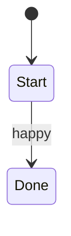

# SC-EXAMPLE — _Tên scenario tiếng Việt_

Scenario dưới **CMP-*** · capability **CAP-***.  
Rule chi tiết trên **base-docs** (chỉ cite id).

| | |
|--|--|
| **Scenario** | `SC-EXAMPLE` |
| **Capability** | `CAP-admin` |
| **Component** | `CMP-00` |
| **Screen** | `W-AD-EXAMPLE-001` |
| **Target** | `CTR-admin-web` |

## Vì sao quan trọng

_1–3 câu cho member: rủi ro / giá trị nghiệp vụ._

## Hành vi (Given / When / Then)

**Given** _điều kiện_  
**When** _hành động_  
**Then** _kết quả_

## Ví dụ (Specification by Example)

| # | Input… | Kết quả mong đợi | Automation |
|---|--------|------------------|------------|
| EX-01 | … | … | `TC-EXAMPLE-VALID` |

## Bao phủ (risk)

| Facet | Có? | Ghi chú |
|-------|-----|---------|
| happy | EX-01 | |
| validation | chưa | backlog |

## Cases

| ID | coverage | Folder |
|----|----------|--------|
| TC-EXAMPLE-VALID | happy | `cases/W-*/` |
